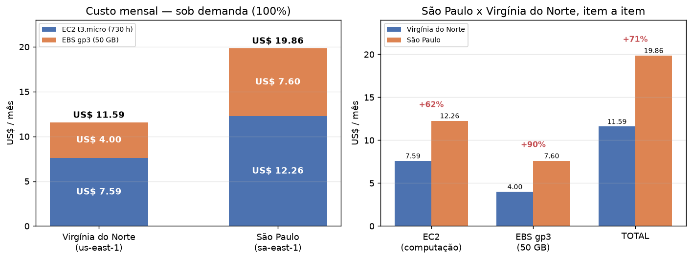
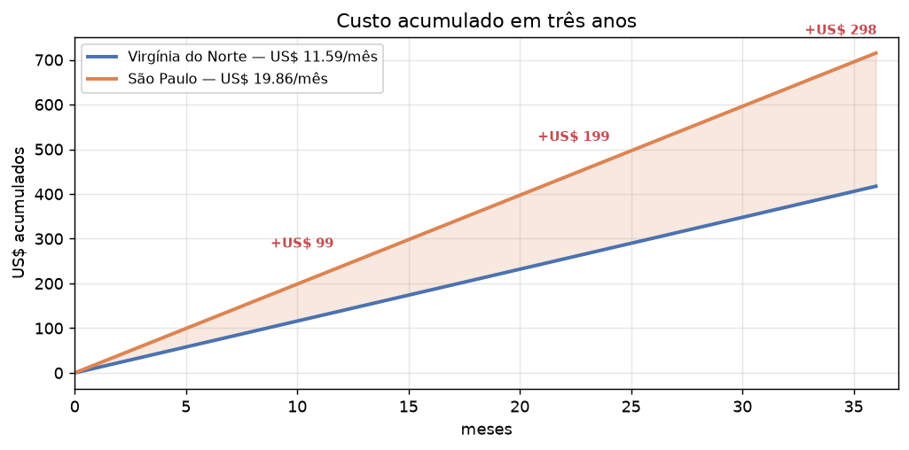
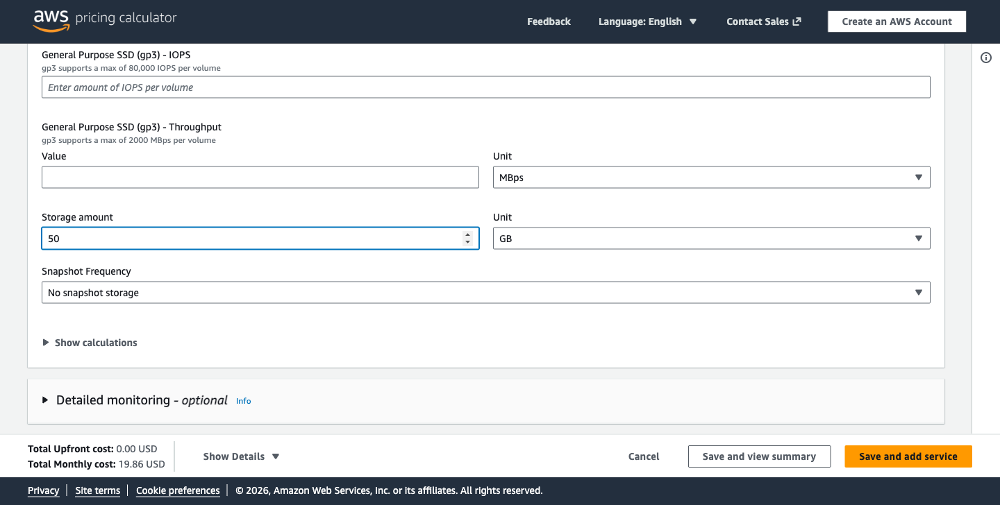
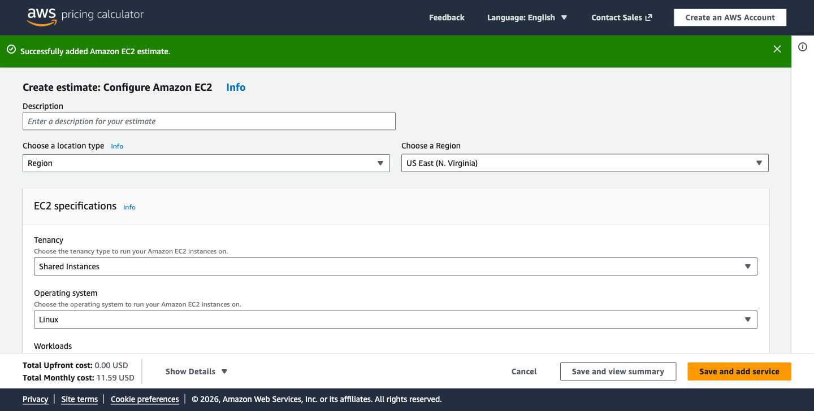
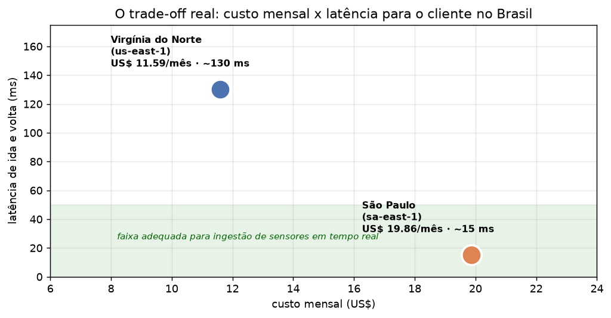

# FarmTech Solutions — Machine Learning na cabeça

**FIAP · Inteligência Artificial · Fase 5 — Cap 1: FarmTech na Era da Cloud Computing**

Douglas Felicio da Silva — RM 572312 · Grupo 56

---

## O que tem aqui

A FarmTech Solutions foi contratada por uma fazenda de 200 hectares que cultiva
quatro produtos. O trabalho tem duas entregas:

| | Entrega | Onde está |
|---|---|---|
| **1** | Modelos de Machine Learning para prever o rendimento de safra | [`notebook/DouglasFelicioDaSilva_rm572312_pbl_fase4.ipynb`](notebook/DouglasFelicioDaSilva_rm572312_pbl_fase4.ipynb) |
| **2** | Estimativa de custo de infraestrutura na AWS | [seção abaixo](#entrega-2--onde-hospedar-o-modelo) |

Os dois vídeos de demonstração estão linkados em cada seção.

---

## Estrutura do repositório

```
.
├── README.md                          você está aqui
├── notebook/
│   ├── DouglasFelicioDaSilva_rm572312_pbl_fase4.ipynb   relatório completo
│   └── gerar_notebook.py              script que monta o notebook
├── dados/
│   ├── crop_yield.csv                 base fornecida no portal
│   ├── montar_csv.py                  reconstrói e confere o CSV
│   └── precos_aws.py                  consulta a API de preços da AWS
└── imagens/                           figuras usadas neste README
```

---

# Entrega 1 — Prevendo o rendimento da safra

## O problema

Prever quanto a fazenda vai colher, a partir de quatro variáveis climáticas:
precipitação, umidade específica, umidade relativa e temperatura. A base tem 156
registros distribuídos entre quatro culturas — cacau, óleo de palma, arroz e
borracha.

## O que foi feito

O relatório completo está no notebook. Ele cobre, nesta ordem:

1. **Análise exploratória** — estrutura da base, distribuição do rendimento,
   correlações e uma investigação sobre a origem dos dados.
2. **Clusterização** — K-Means e DBSCAN, com identificação de cenários
   discrepantes.
3. **Cinco modelos preditivos** — Regressão Linear, Árvore de Decisão, Random
   Forest, Gradient Boosting e SVR, todos sob o mesmo protocolo de avaliação.

**➡️ [Abrir o notebook](notebook/DouglasFelicioDaSilva_rm572312_pbl_fase4.ipynb)** —
todas as células estão executadas, com as saídas e os gráficos gravados.

## O resultado que importa

Os cinco modelos atingem R² acima de 0,92, quatro deles acima de 0,98. Parece
excelente — e é justamente aí que está a armadilha.

Um baseline que **ignora completamente o clima** e prevê apenas a média
histórica de cada cultura atinge **R² = 0,9842**, superando os cinco modelos.

| Modelo | R² | RMSE | MAPE |
|---|---|---|---|
| **Baseline (média da cultura)** | **0,9842** | **8.701** | 12,26% |
| Regressão Linear | 0,9812 | 9.513 | 17,83% |
| Árvore de Decisão | 0,9797 | 9.801 | **11,36%** |
| Random Forest | 0,9788 | 10.030 | 11,38% |
| Gradient Boosting | 0,9787 | 10.059 | 11,82% |
| SVR (RBF) | 0,9206 | 19.525 | 41,07% |

A explicação: **a cultura plantada sozinha explica 98,76% da variância do
rendimento**. O óleo de palma rende, em média, vinte vezes mais que a borracha.
O R² global mede apenas a capacidade de distinguir as culturas — coisa que a
própria coluna `cultura` já entrega de graça.

Medido *dentro* de cada cultura, o R² dos modelos fica próximo de zero, e
frequentemente negativo.

## Três descobertas sobre a base

**As quatro culturas compartilham exatamente as mesmas medições climáticas.** Não
existem 156 observações independentes — existem **39**, cada uma repetida quatro
vezes.

**As 39 observações parecem uma série temporal.** O rendimento do arroz tem
correlação de **0,91** com a posição no arquivo; a umidade específica, **0,80**.
Duas séries que sobem juntas produzem correlação alta sem relação causal — o
0,70 entre umidade e rendimento do arroz provavelmente mede ganho tecnológico ao
longo dos anos, não efeito do clima.

**Culturas reagem em direções opostas.** O arroz responde positivamente a calor
e umidade (0,70 e 0,61); a borracha, negativamente (−0,43 e −0,41). Um modelo
agregado anula os dois efeitos.

## Resposta ao cliente

Com os dados atuais, a previsão prática é a **média histórica da cultura**, com
o modelo de árvore aparando cerca de 7% do erro. Erro esperado: **11% a 12%**.

O caminho para melhorar não passa por um algoritmo mais sofisticado — os cinco
testados já esgotaram o que estes dados oferecem. Passa por coletar a **data de
cada safra** (para separar clima de tendência) e **variáveis de manejo** (solo,
adubação, cultivar), que é onde provavelmente está a explicação que falta.

## 🎥 Vídeo da Entrega 1

**[Assistir no YouTube](VIDEO_1_URL)** *(não listado, até 5 minutos)*

---

# Entrega 2 — Onde hospedar o modelo

## A pergunta

Estimar o custo de uma máquina Linux para hospedar a API que recebe os dados dos
sensores e executa o modelo, comparando **São Paulo (BR)** e **Virgínia do Norte
(EUA)**, no modelo **sob demanda (On-Demand, 100%)**.

Configuração exigida:

- 2 CPUs
- 1 GiB de memória
- Até 5 Gigabit de rede
- 50 GB de armazenamento

## A instância escolhida: `t3.micro`

A busca na calculadora da AWS por instâncias que atendam aos requisitos retorna
o `t3.micro` como opção de menor custo. Ela atende à especificação **exatamente**,
sem folga nem desperdício:

| Requisito | `t3.micro` |
|---|---|
| 2 CPUs | 2 vCPU ✅ |
| 1 GiB de memória | 1 GiB ✅ |
| Até 5 Gigabit de rede | *Up to 5 Gigabit* ✅ |
| 50 GB de disco | EBS gp3, 50 GB ✅ |

Vale registrar o que foi descartado: o `t2.micro` tem apenas 1 vCPU e não atende;
o `t3.small` tem 2 GiB e custaria o dobro sem necessidade.

## Os números

Preços de agosto de 2026, obtidos na [calculadora oficial da
AWS](https://calculator.aws) e conferidos contra a API pública de preços da AWS —
a mesma fonte que alimenta a calculadora.

| Item | Virgínia do Norte (`us-east-1`) | São Paulo (`sa-east-1`) | Diferença |
|---|---|---|---|
| EC2 `t3.micro` (hora) | US$ 0,0104 | US$ 0,0168 | +62% |
| EC2 `t3.micro` (730 h/mês) | US$ 7,59 | US$ 12,26 | +62% |
| EBS gp3 (por GB-mês) | US$ 0,080 | US$ 0,152 | +90% |
| EBS gp3 (50 GB) | US$ 4,00 | US$ 7,60 | +90% |
| **Total mensal** | **US$ 11,59** | **US$ 19,86** | **+71,4%** |
| **Total anual** | **US$ 139,10** | **US$ 238,37** | **+US$ 99,26** |



O disco pesa mais na diferença que o processamento: o gp3 custa 90% mais caro em
São Paulo, contra 62% do EC2.



Em três anos a diferença acumulada chega a **US$ 298** — relevante em termos
percentuais, modesto em valor absoluto para uma operação de 200 hectares.

### Capturas da calculadora

| São Paulo — US$ 19,86/mês | Virgínia do Norte — US$ 11,59/mês |
|---|---|
|  |  |

> **Atenção a um detalhe da calculadora:** por padrão ela aplica *Compute Savings
> Plans 3yr No Upfront* como estratégia de preço, o que devolve US$ 13,73/mês
> para São Paulo. O enunciado pede **On-Demand 100%**, então a estratégia foi
> trocada manualmente em *Other purchasing options → On-Demand*. Só então o valor
> correto de US$ 19,86 aparece.

## A decisão: São Paulo

O enunciado acrescenta duas restrições ao problema: **acesso rápido aos dados dos
sensores** e **restrições legais para armazenamento no exterior**. Com elas, a
resposta deixa de ser a mais barata.

### 1. A restrição legal decide sozinha

A LGPD (Lei 13.709/2018) não proíbe transferência internacional de dados, mas a
condiciona (art. 33) a hipóteses específicas — país com grau de proteção
adequado, cláusulas contratuais padrão, normas corporativas globais ou
consentimento específico e destacado do titular.

Dados de sensores agrícolas viram dados pessoais assim que se associam ao
produtor rural, à sua propriedade ou aos operadores identificados nos registros —
que é exatamente o caso aqui. Manter tudo em `sa-east-1` **elimina a questão**:
sem transferência internacional, não há hipótese legal a demonstrar, nem
cláusulas a manter, nem risco de reclassificação futura.

O enunciado já afirma que há restrição legal. Isso encerra a discussão: a
economia de US$ 8,27/mês não compra a exposição jurídica.

### 2. A latência confirma a escolha



De um cliente no Brasil, a latência de ida e volta até `sa-east-1` fica em torno
de **15–30 ms**; até `us-east-1`, em **110–140 ms** — cerca de **8 vezes maior**,
imposta pela distância física, que nenhuma otimização de software resolve.

Para ingestão contínua de sensores, o impacto é concreto:

- cada leitura enviada por um ESP32 no campo paga a latência **duas vezes**
  (requisição e confirmação);
- dispositivos IoT costumam ter *timeout* curto e reenviam em caso de demora,
  multiplicando tráfego e custo de transferência;
- se a inferência precisar realimentar um alerta ao operador em campo, 140 ms de
  ida e volta consomem boa parte do orçamento de tempo de uma decisão
  operacional.

### 3. O custo, em perspectiva

A diferença é de **US$ 8,27 por mês** — cerca de R$ 45. Para uma fazenda de 200
hectares, é ruído orçamentário. Trocar isso por risco jurídico e por latência
oito vezes maior seria uma economia mal colocada.

### Resumo da justificativa

| Critério | Virgínia do Norte | São Paulo | Decide por |
|---|---|---|---|
| Custo mensal | US$ 11,59 | US$ 19,86 | Virgínia |
| Latência do Brasil | ~130 ms | ~15 ms | **São Paulo** |
| Conformidade com a LGPD | exige base legal do art. 33 | sem transferência internacional | **São Paulo** |
| Soberania do dado | fora do país | em território nacional | **São Paulo** |

**Conclusão: `sa-east-1` (São Paulo).** A Virgínia do Norte só passaria a fazer
sentido para cargas assíncronas que não tocam dado pessoal — por exemplo, o
retreinamento periódico do modelo sobre dados já anonimizados, onde latência não
importa e o custo por hora de GPU pesa. Fica como possibilidade de arquitetura
híbrida, não como escolha para a API de ingestão.

## 🎥 Vídeo da Entrega 2

**[Assistir no YouTube](VIDEO_2_URL)** *(não listado, até 5 minutos)*

---

## Como reproduzir

```bash
python3 -m venv .venv
.venv/bin/pip install pandas numpy scikit-learn matplotlib seaborn jupyter

# reconstrói e confere a base
.venv/bin/python dados/montar_csv.py

# executa o notebook inteiro
.venv/bin/jupyter nbconvert --to notebook --execute --inplace \
  notebook/DouglasFelicioDaSilva_rm572312_pbl_fase4.ipynb

# reconsulta os preços da AWS
.venv/bin/python dados/precos_aws.py
```

O notebook usa semente fixa (`SEMENTE = 42`) em todas as etapas aleatórias —
divisão treino/teste, K-Means, DBSCAN e os modelos. Qualquer execução reproduz
exatamente os números citados neste README.
