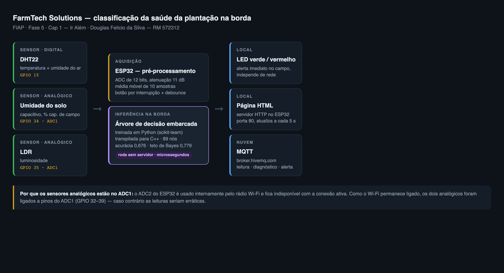

# Ir Além — Classificação da saúde da plantação com Machine Learning e ESP32

**FIAP · Inteligência Artificial · Fase 5 — Cap 1**
Douglas Felicio da Silva — RM 572312

Entrega da **Opção 2** do Ir Além. Como a solução também coleta dados com dois
sensores distintos, conecta por Wi-Fi e publica em broker MQTT e em página HTML,
ela cumpre igualmente os requisitos técnicos da **Opção 1**.

---

## A ideia em uma frase

Um ESP32 lê três sensores, decide sozinho se a plantação está saudável e publica
o diagnóstico — **sem depender de servidor para classificar**.

O modelo foi treinado em Python com scikit-learn e depois **transpilado para C++
puro**, virando parte do firmware. É o que se chama de inferência na borda:
a placa não envia dados para alguém decidir por ela; ela já decide.

### Por que isso importa no campo

Uma lavoura raramente tem Wi-Fi confiável. Se a classificação dependesse da
nuvem, uma queda de conexão deixaria o produtor sem diagnóstico justamente
quando o sensor detecta estresse hídrico. Com o modelo embarcado:

- o diagnóstico continua funcionando **offline**, acionando o alerta local;
- a latência é de **microssegundos**, não de centenas de milissegundos;
- o consumo de rede cai — só o resultado trafega, não o fluxo bruto de leituras.

---

## Arquitetura



```
  DHT22 (GPIO 15) ─┐
  Solo  (GPIO 34) ─┼──> ESP32 ──> média móvel ──> árvore embarcada ──> diagnóstico
  LDR   (GPIO 35) ─┘                (10 amostras)     (C++ puro)          │
                                                                          ├──> LED verde / vermelho
                                                                          ├──> página HTML na porta 80
                                                                          └──> MQTT (broker.hivemq.com)
```

### Sensores e por que estes

| Sensor | Pino | Grandeza | Por que entra no modelo |
|---|---|---|---|
| DHT22 | GPIO 15 | temperatura e umidade do ar | o segundo fator limitante da cultura; sensor digital, duas grandezas de uma vez |
| Umidade do solo (capacitivo) | GPIO 34 | % da capacidade de campo | **o fator limitante primário** — é a variável de maior peso no modelo (0,51) |
| LDR | GPIO 35 | luminosidade | discrimina sombreamento excessivo, comum em consórcio agroflorestal |

### Uma decisão de projeto que evita um bug difícil

Os dois sensores analógicos estão em **GPIO 34 e 35, que pertencem ao ADC1**.
Isso é deliberado: o ESP32 tem dois conversores, e o **ADC2 é usado internamente
pelo rádio Wi-Fi**, ficando indisponível enquanto a conexão está ativa. Como
este projeto mantém o Wi-Fi ligado o tempo todo, ligar um sensor no ADC2
produziria leituras erráticas — com o agravante de que o sintoma aparece só
depois que a rede conecta, o que torna o diagnóstico difícil.

---

## O modelo

### O dataset não veio de uma regra

O caminho fácil seria rotular "saudável" com um `if` sobre as leituras. O
problema: o modelo treinado nesse dado apenas reaprende a regra que o gerou, e a
acurácia alta vira ilusão. Foi exatamente esse erro que a Sprint 3 do Challenge
Sompo nos ensinou a evitar.

Aqui o rótulo sai de um processo probabilístico:

1. cada grandeza contribui com um **estresse contínuo**, medido pela distância à
   sua faixa fisiológica ótima;
2. os estresses somam em **log-odds**, com uma interação entre seca e calor —
   solo seco com temperatura alta castiga mais que a soma dos dois isolados;
3. entra um **fator de vigor da planta** (idade, cultivar, histórico de adubação)
   que o ESP32 **não mede** — e por isso vira erro irredutível;
4. o desfecho é **sorteado** de uma Bernoulli.

O resultado é uma fronteira difusa: leituras idênticas podem gerar rótulos
diferentes, como no campo.

**Consequência importante:** existe um teto. O melhor classificador concebível —
aquele que conhece a própria probabilidade que gerou o dado — acerta **77,88%**.
Nenhum modelo pode passar disso.

### Desempenho

| Modelo | Acurácia | F1 | AUC | Cabe no ESP32? |
|---|---|---|---|---|
| Baseline (classe majoritária) | 0,5020 | 0,000 | 0,500 | — |
| Regressão Logística | 0,5890 | 0,591 | 0,632 | sim |
| **Árvore de decisão (embarcada)** | **0,6760** | **0,680** | **0,739** | **sim** |
| Random Forest (referência) | 0,6980 | 0,706 | 0,755 | inviável |
| *Teto teórico (Bayes)* | *0,7788* | — | — | — |

A árvore embarcada alcança **86,8% do máximo teoricamente possível**, e fica a
apenas 2,2 pontos do Random Forest — que precisaria de 300 árvores e não caberia
confortavelmente no microcontrolador.

Reportar "acurácia de 67,6%" sem o teto de 77,9% ao lado seria enganoso nos dois
sentidos: parece pouco, mas é quase tudo o que estes sensores permitem extrair.

### O que o modelo aprendeu

| Grandeza | Importância |
|---|---|
| umidade do solo | 0,513 |
| temperatura | 0,378 |
| umidade do ar | 0,092 |
| luminosidade | 0,016 |

A ordem reproduz a agronomia: água e temperatura são os fatores limitantes
primários. O modelo chegou nisso sozinho — não foi imposto.

### Da árvore ao firmware

O `treinar.py` percorre a estrutura interna do sklearn e emite C++: cada nó
interno vira um `if`, cada folha vira o retorno da classe com a confiança medida
naquela folha.

```cpp
inline Diagnostico classificarSaude(const Leitura& leitura) {
    if (leitura.umidade_solo <= 31.8163f) {
      if (leitura.temperatura <= 33.3169f) {
        ...
        return { NAO_SAUDAVEL, 0.7143f };
```

São **89 nós e 45 folhas**, em 222 linhas de C++ — alguns KB dos 4 MB de flash.
Sem alocação de memória, sem biblioteca, sem ponto flutuante de dupla precisão.

### A transpilação foi verificada, não presumida

Transpilar um modelo só vale se a versão embarcada for **fiel** à original. O
`validar_transpilacao.py` compila o header com um `main` de teste, passa as
4.000 amostras do dataset pelas duas implementações e exige concordância total:

```
Compilação do header: OK
Amostras testadas   : 4000
Divergências        : 0

O C++ embarcado reproduz o modelo Python em 100% das amostras.
```

---

## O firmware

Além da inferência, o firmware aplica de forma explícita o conteúdo dos
capítulos da fase:

| Recurso | Onde está | Capítulo |
|---|---|---|
| Média móvel de 10 amostras | `mediaBuffer()` — elimina o ruído do ADC | Cap 6 |
| ADC1 para analógicos com Wi-Fi ativo | GPIO 34 e 35 | Cap 6 |
| Resolução de 12 bits e atenuação de 11 dB | `analogReadResolution()` / `analogSetAttenuation()` | Cap 6 |
| `attachInterrupt()` no botão | leitura sob demanda | Cap 7 |
| `millis()` para debounce | evita repique mecânico | Cap 7 |
| `IRAM_ATTR` e `volatile` na ISR | corretude da interrupção | Cap 7 |
| Wi-Fi em modo estação | `WiFi.mode(WIFI_STA)` | Cap 7 |
| MQTT (publicação) | `PubSubClient` | Cap 7 |
| Servidor HTTP embarcado | página de status na porta 80 | Cap 7 |

### O diagnóstico explica a causa

Dizer "não saudável" não ajuda ninguém. A função `causaProvavel()` aponta qual
grandeza puxou o resultado, combinando **dois** fatores:

```
desvio normalizado pela largura da faixa  ×  importância da grandeza no modelo
```

A normalização torna grandezas de escalas diferentes comparáveis; a importância
— exportada junto com a árvore — garante que a explicação aponte o que
realmente moveu a decisão.

```
solo  8.0% | temp 39.0C | ar 25.0% | luz 54.0%  ->  NAO SAUDAVEL
(conf. 100%, 7us) | umidade do solo abaixo da faixa ideal
```

**Este ponto surgiu de um teste que falhou.** Na primeira versão o critério era
só o desvio normalizado, e o caso acima culpava a *umidade do ar* — cujo desvio
relativo é maior (1,40 contra 1,23 do solo). Mas quem decide ali é o solo, que
vale **0,513** no modelo contra **0,092** do ar. A ponderação corrigiu isso.

### Testes automatizados do firmware

O firmware é compilado num PC contra stubs das APIs Arduino
(`testes/stubs_arduino.h`) e exercitado em cenários de campo. Não substitui o
teste em hardware — mas pega erros de tipo, chamada e lógica, que são os que
custam caro quando descobertos só na hora de gravar a placa.

```bash
cd testes
c++ -std=c++17 -I../firmware -I. -x c++ testar_firmware.cpp -o teste && ./teste
```

| Verificação | O que prova |
|---|---|
| `setup()` executa sem travar | inicialização de sensores, Wi-Fi, MQTT e HTTP |
| média móvel preenchida no boot | não há diagnóstico baseado em amostra única |
| pico isolado desloca a média < 8 pontos | a suavização funciona |
| repique de 40 ms é descartado | o debounce da interrupção protege |
| toque após 250 ms é aceito | o debounce não bloqueia o uso legítimo |
| condição ótima → saudável | o modelo responde na direção certa |
| seca severa com calor → não saudável | idem, no extremo oposto |
| confiança dentro de [0, 1] | a transpilação não corrompeu as folhas |
| na seca, aponta o solo | a explicação ponderada está correta |

Um detalhe visível no log: conforme o solo seca de 54,8% para 8%, a confiança
sobe de **0,551 → 0,911 → 1,000** e a causa migra de "temperatura acima da
faixa" para "umidade do solo abaixo da faixa". O sistema não só troca o
veredito — ele muda de opinião sobre o motivo, na ordem certa.

### Tópicos MQTT

| Tópico | Quando publica |
|---|---|
| `farmtech/rm572312/leitura` | a cada ciclo — leituras já suavizadas |
| `farmtech/rm572312/diagnostico` | a cada ciclo — classe, confiança e causa |
| `farmtech/rm572312/alerta` | **só quando não saudável** — evita poluir o tópico |

---

## Como rodar

### No Wokwi (sem hardware)

1. Abra [wokwi.com/projects/new/esp32](https://wokwi.com/projects/new/esp32)
2. Cole `firmware/diagram.json` na aba `diagram.json`
3. Cole `firmware/farmtech_esp32.ino` na aba `sketch.ino`, substituindo a linha
   `#include "modelo_embarcado.h"` pelo conteúdo do header (o Wokwi gratuito não
   cria arquivos adicionais)
4. No Library Manager, adicione `DHT sensor library` e `PubSubClient`
5. Rode. Gire o potenciômetro para simular a umidade do solo e veja o LED trocar.

### Em ESP32 físico

```bash
# bibliotecas
arduino-cli lib install "DHT sensor library" "PubSubClient"

# compilar e gravar
arduino-cli compile --fqbn esp32:esp32:esp32 firmware/
arduino-cli upload  --fqbn esp32:esp32:esp32 -p /dev/cu.SLAB_USBtoUART firmware/
```

Ajuste `WIFI_SSID` e `WIFI_SENHA` no início do `.ino`. Depois de conectar, o
endereço IP aparece no monitor serial e a página de status responde nele.

### Retreinar o modelo

```bash
python modelo/gerar_dataset.py        # gera o dataset
python modelo/treinar.py              # treina e regenera modelo_embarcado.h
python modelo/validar_transpilacao.py # prova que o C++ = Python
```

O header é **gerado**, não escrito à mão. Alterar os pesos ou as faixas em
`gerar_dataset.py` e rodar os três comandos produz um firmware novo e coerente.

---

## Estrutura

```
ir-alem/
├── README.md                        este documento
├── firmware/
│   ├── farmtech_esp32.ino           firmware principal
│   ├── modelo_embarcado.h           árvore transpilada (GERADO)
│   ├── diagram.json                 circuito do Wokwi
│   └── libraries.txt                dependências
└── modelo/
    ├── gerar_dataset.py             dataset com rótulo probabilístico
    ├── treinar.py                   treino, comparação e transpilação
    ├── validar_transpilacao.py      prova de fidelidade C++ ↔ Python
    ├── metricas.json                resultados medidos
    └── dataset_info.json            faixas, pesos e teto de Bayes
```

---

## Limitações — e elas são reais

1. **A execução foi simulada no Wokwi**, não em placa física. O firmware é o
   mesmo que roda em hardware real e está pronto para gravação, mas não houve
   validação com sensores reais em campo.

2. **O dataset é sintético.** As faixas fisiológicas vêm da literatura
   agronômica, e o processo gerador foi construído para não ser trivialmente
   aprendível — mas continua sendo um modelo do mundo, não o mundo. Com dados
   reais de uma safra, os limiares mudariam.

3. **Teto de 77,9% de acurácia.** Não é limitação do algoritmo: é o efeito do
   vigor da planta, que nenhum dos três sensores mede. Para subir esse teto seria
   preciso outro sensor — NDVI por imagem, por exemplo — e não outro modelo.

4. **O broker MQTT é público.** `broker.hivemq.com` serve para demonstração;
   uma operação real exige broker autenticado e TLS.

5. **Sem persistência a bordo.** Se o Wi-Fi cair, o diagnóstico continua local,
   mas as leituras daquele período se perdem. O passo natural seria um buffer em
   SPIFFS com reenvio ao reconectar.

---

## 🎥 Vídeo

**▶️ [Assistir no YouTube](VIDEO_IR_ALEM_URL)** — não listado, até 5 minutos
